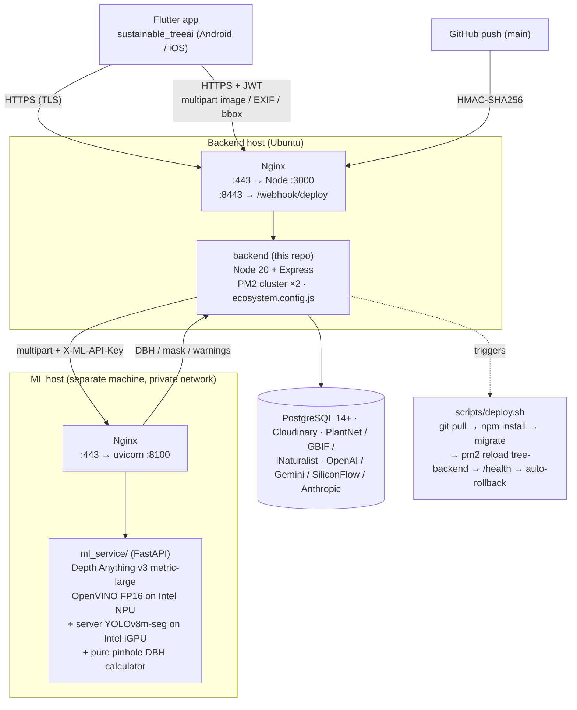
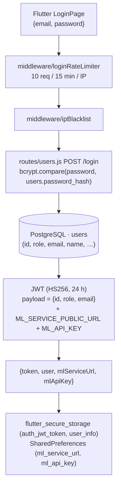
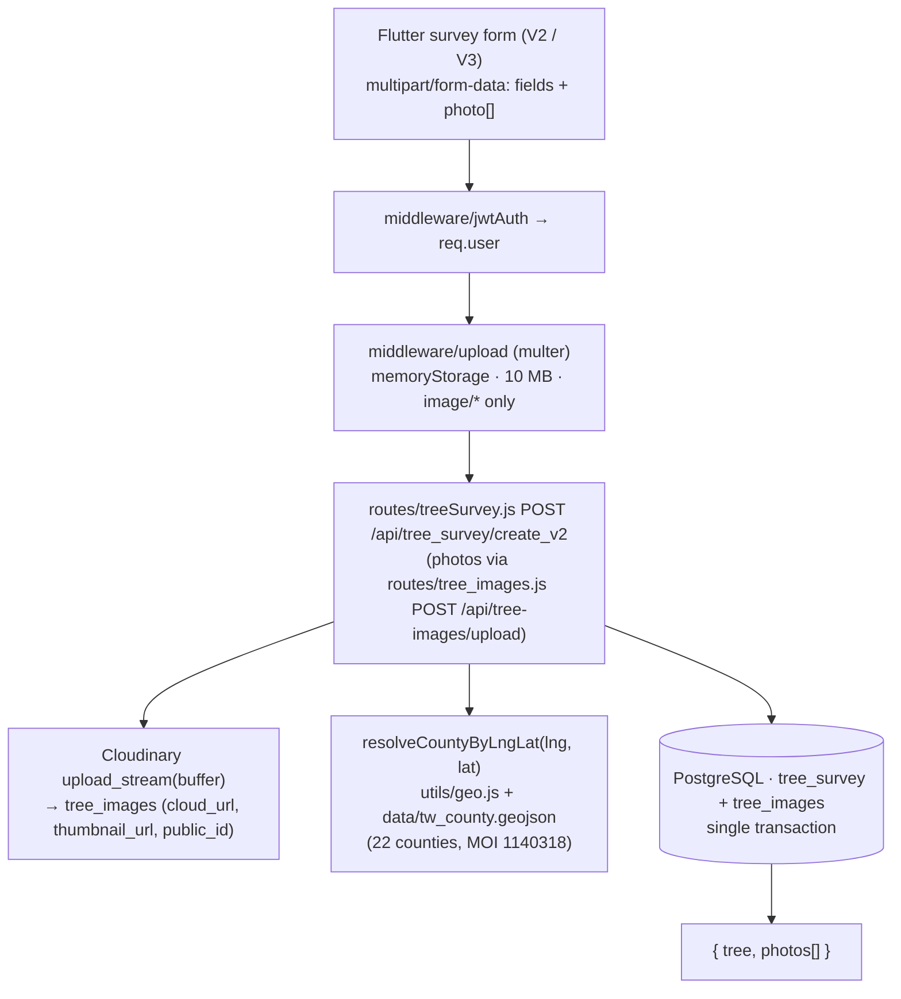
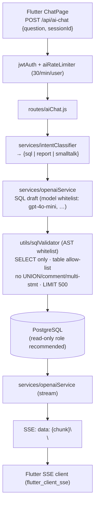
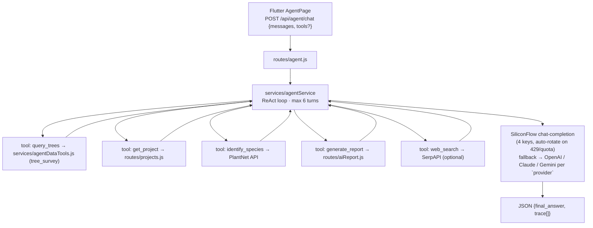
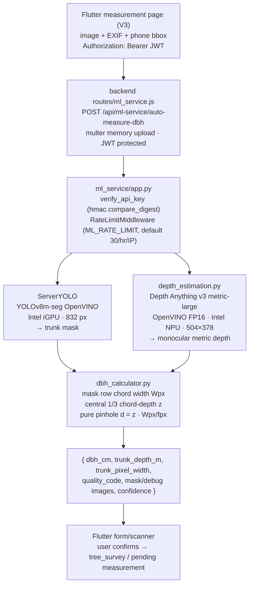
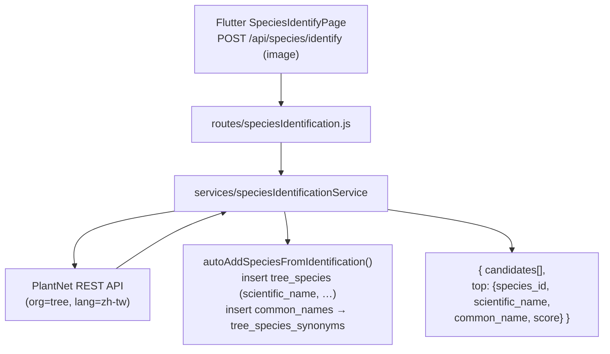
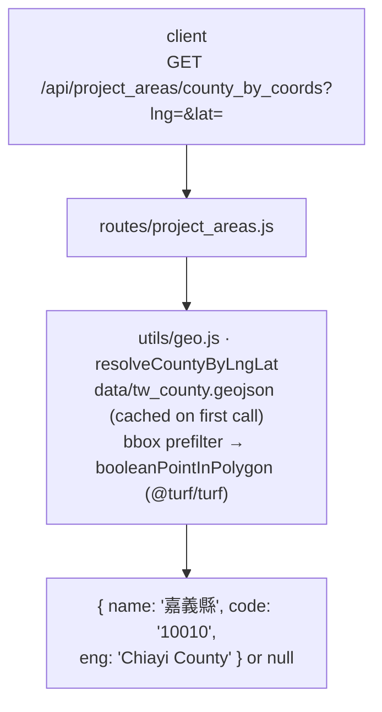
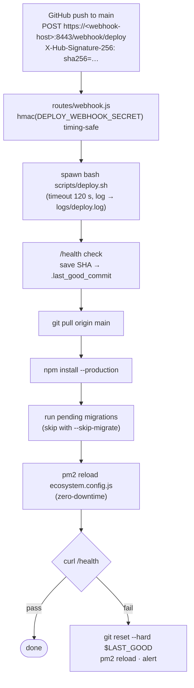

# tree-survey-backend


Node.js / Express REST API powering the Flutter app `tree-project-frontend`.
Handles authentication, tree-survey CRUD, project/area management, image
storage (Cloudinary), reverse-proxying to a Python ML service, an AI chat
assistant (Text-to-SQL) and a tool-using AI Agent.

Production runs on a self-hosted Ubuntu host behind a reverse proxy
(Nginx; the original deployment used Tailscale for private networking), with
PM2 cluster-mode supervision (see `ecosystem.config.js`).

---

## Architecture overview



**Two-service deployment with a Node ML proxy.** The Flutter app talks to
the Node backend for CRUD/auth/AI and for static DBH measurement through
`/api/ml-service/*`. The backend then forwards multipart images to the
FastAPI `ml_service` and injects `X-ML-API-Key` from the host environment,
so the ML API key is not stored on the client. Legacy or experimental live
scan paths may still talk to the FastAPI host directly, but the production
DBH HTTP flow is `Flutter → Node proxy → FastAPI`.

> The exact public hostnames, private-network IPs and reverse-proxy domains
> are deployment-specific and **not** committed to this repo. Configure
> them via environment variables (`BASE_URL`, `ML_SERVICE_URL`,
> `ML_SERVICE_PUBLIC_URL`, `CORS_ALLOWED_ORIGINS`) on the host.

---

## Feature flows

Each subsection traces one user-visible feature from the Flutter app down to
the database / external services. Bracketed paths are files in this repo.

### 1. Authentication (`POST /api/login`)



Logout is client-side only (delete token + clear ML credentials).

### 2. Tree survey CRUD with image upload



GET / PUT / DELETE follow the same auth + ownership-check pattern in
[routes/treeSurvey.js](routes/treeSurvey.js) (tree records) and
[routes/tree_images.js](routes/tree_images.js) (photos).

### 3. AI chat — Text-to-SQL with SSE streaming



Audit trail: every Q/A pair + classified intent + final SQL is written to
`ai_chat_logs` (see [routes/aiChat.js](routes/aiChat.js) and
[middleware/aiAuditLog.js](middleware/aiAuditLog.js)).

### 4. AI agent — tool-using (`/api/agent/*`)



### 5. ML pipeline — Auto DBH measurement



The production static DBH flow goes through the Node proxy. `WebSocket
/ws/scan` is kept for live preview experiments and should be treated as
optional unless it is routed through the same authentication path.

### 6. Species identification (`/api/species/*`)



V3 form auto-creates a species row at submit time
([services/speciesIdentificationService.js](services/speciesIdentificationService.js))
so the user never has to "save species" manually.

### 7. County auto-detection



`scripts/backfill_county.js --apply` re-runs the helper for every
`projects.area` row whose `county` is NULL.

### 8. Auto-deploy (GitHub webhook → production)



`GET /webhook/status` (Bearer `ADMIN_API_TOKEN`) returns the tail of
`logs/deploy.log`.

---

## Stack

- Node.js >= 18 (production runs on 20)
- Express 4 + helmet + express-rate-limit
- PostgreSQL >= 14 (`pg` + `pg-format` + `pg-copy-streams`)
- JWT (`jsonwebtoken`, HS256, fixed algorithm)
- bcryptjs for password hashing
- Multer for file uploads, ExcelJS / xlsx for import-export, PDFKit for reports
- Cloudinary SDK for image storage
- AI SDKs: `openai`, `@anthropic-ai/sdk`, `@google/generative-ai`
- `@turf/turf` for point-in-polygon (county auto-detection, project boundaries)
- PM2 (cluster mode, 2 workers — see `ecosystem.config.js`)

---

## Quick start

```bash
cd backend
cp tree-app-backend-prod.env .env   # then edit values (see Configuration)
npm install
node scripts/migrate.js             # fresh empty DB: schema only (+ optional dev CSV)
node scripts/seed_dev_users.js    # dev/CI only: test accounts (NOT for production)
npm run dev                         # nodemon on PORT (default 3000)
```

Health check: `GET /health` → `200 OK` (no auth required).

In `production` mode, `app.js` runs `scripts/run_pending_migrations.js`
automatically on startup (schema only; no CSV import). For a fresh empty DB,
run `node scripts/migrate.js` manually once.

---

## Configuration

All configuration is via environment variables loaded with `dotenv` from
`.env`. The keys actually read by the code:

### Server / runtime
| Key | Default | Notes |
|-----|---------|-------|
| `NODE_ENV` | — | When `production`: required env-vars enforced, migrations auto-run, error responses are sanitized, model whitelist enforced for AI chat |
| `PORT` | `3000` | Express listen port |
| `BASE_URL` | `http://localhost:${PORT}` | Used to build full URLs for AI chat Excel-export download links |

### Database (`config/db.js`)
| Key | Notes |
|-----|-------|
| `DATABASE_URL` | PostgreSQL connection string. Required in production |
| `DB_HOST` / `DB_USER` / `DB_PASSWORD` / `DB_NAME` / `DB_PORT` | Discrete connection params (fallback when `DATABASE_URL` is unset). First admin: `node scripts/create_lab_admin.js` (production) or `seed_dev_users.js` (dev/CI only) |
| `DB_SSL_REJECT_UNAUTHORIZED` | `true` to enforce TLS cert verification; default `false` (typical for Render-style providers) |

### Auth (`middleware/jwtAuth.js`)
| Key | Notes |
|-----|-------|
| `JWT_SECRET` | Required in production. HS256 only — algorithm-confusion attack is blocked |
| `JWT_EXPIRES_IN` | Default `24h` |

### CORS (`app.js`)
| Key | Notes |
|-----|-------|
| `CORS_ALLOWED_ORIGINS` (or `CORS_ORIGIN`) | Comma-separated whitelist. In production, an empty list = deny all cross-origin. Same-origin and missing `Origin` header (mobile apps) are always allowed |

### Cloudinary (`config/cloudinary.js`)
| Key | Notes |
|-----|-------|
| `CLOUDINARY_CLOUD_NAME` / `CLOUDINARY_API_KEY` / `CLOUDINARY_API_SECRET` | All three needed for upload to be active. If unset, image upload is disabled (the code returns a clear warning instead of crashing) |

### Reverse-proxied ML service (`routes/ml_service.js`, `routes/users.js`)
| Key | Notes |
|-----|-------|
| `ML_SERVICE_URL` | Internal URL of the Python FastAPI service (e.g. `http://127.0.0.1:8100`) |
| `ML_SERVICE_PUBLIC_URL` | Optional. Public URL returned to the client by `/login`; falls back to `ML_SERVICE_URL` |
| `ML_API_KEY` | Sent as `X-ML-API-Key` to the FastAPI service |

### AI providers
| Key | Used by | Notes |
|-----|---------|-------|
| `GEMINI_API_KEY` | `services/geminiService.js` | Google Gemini (chat + report generation) |
| `OPENAI_API_KEY` | `services/openaiService.js`, `routes/ai.js`, `routes/admin.js` | OpenAI |
| `Claude_API_KEY` | `routes/ai.js`, `routes/admin.js`, `scripts/generate_species_knowledge.js` | Anthropic |
| `SiliconFlow_API_KEY`, `Alt1_SiliconFlow_API_KEY`, `Alt2_…`, `Alt3_…` | `services/agentService.js` | SiliconFlow (free tier). Up to 4 keys are loaded; agent rotates to the next when one is exhausted |
| `PLANTNET_API_KEY` | `services/speciesIdentificationService.js`, `routes/speciesIdentification.js` | PlantNet (image-based species ID) |

### GitHub auto-deploy (`routes/webhook.js`)
| Key | Notes |
|-----|-------|
| `DEPLOY_WEBHOOK_SECRET` | HMAC-SHA256 secret. Validated against `X-Hub-Signature-256` using a timing-safe compare |
| `ADMIN_API_TOKEN` | Token to read `GET /webhook/status` (deploy log tail). The only place a static token is still accepted |

### Other
| Key | Notes |
|-----|-------|
| `DISABLE_IP_GUARD` | `true` to disable the IP-blacklist middleware (testing only) |
| `TEST_BASE_URL`, `TEST_ADMIN_USER`, `TEST_ADMIN_PASS`, `TEST_SURVEY_USER`, `TEST_SURVEY_PASS` | Used by `tests/regression.test.js` and `tests/apiIntegration.test.js` |

---

## Scripts

`package.json`:

| Script | Command |
|--------|---------|
| `npm start` | `node app.js` |
| `npm run dev` | `nodemon app.js` |
| `npm test` | Intent classification + SQL validation tests |
| `npm run test:intent` | Intent classifier only |
| `npm run test:sql` | SQL validation only |
| `npm run test:integration` | Chat integration |
| `npm run test:api` | API integration |
| `npm run test:regression[:local|:verbose]` | Regression suite (against deployed API; `:local` targets `localhost:3000`) |
| `npm run test:all` | Regression + API + security audit |

The tests under `tests/` are plain Node scripts, not a framework.

`scripts/`:

| File | Purpose |
|------|---------|
| `migrate.js` | Reads schema files in `database/initial_data/` in a fixed order, executes them in one transaction-friendly sequence, COPYs `tree_survey_data.csv` (with on-the-fly date sanitization), creates views, and resets the `tree_survey` PK sequence. Idempotent — every migration uses `IF NOT EXISTS` / `CREATE OR REPLACE` / safe upserts |
| `deploy.sh` | Production auto-deploy: saves rollback point, `git pull`, `npm install --production`, runs migrations (unless `--skip-migrate`), PM2 graceful reload, health-check; auto-rollback on failure |
| `rollback.sh` | Manual rollback to `.last_good_commit` |
| `backup_db.sh` | `pg_dump` wrapper for the nightly cron |
| `health_check.sh` | Curl `/health`, used by external monitoring |
| `populateSpeciesRegionScore.js` | Computes per-region species suitability scores. Run inside `migrate.js` automatically |
| `enrich_species_synonyms.js` | LLM-assisted synonym expansion (deprecated — superseded by Text-to-SQL) |
| `generate_species_knowledge.js`, `populate_knowledge.js`, `populate_knowledge_from_survey.js`, `generateEmbeddings.js` | Knowledge-base / RAG seed scripts. **Not part of the standard pipeline** since the 2025-11 switch to Text-to-SQL; kept for the legacy embedding table |
| `migrate_placeholder_fix.js` | One-off historical cleanup; safe to re-run |

---

## Directory layout

```
backend/
├── app.js                          # Entry. Trust proxy → CORS → helmet → JSON
│                                   # → /health → /webhook → /api(ipBlacklist→
│                                   # burstLimiter→apiLimiter→jwtAuth→router)
│                                   # → global error handler. Hourly cleanup
│                                   # cron and one-shot 5s-after-startup
│                                   # chat-log cleanup are also kicked off here.
├── config/
│   ├── db.js                       # pg.Pool (DATABASE_URL, optional SSL)
│   ├── cloudinary.js               # SDK config + isCloudinaryConfigured guard
│   └── apiKeys.js                  # Static helper for AI key lookup
├── controllers/                    # Thin handlers called from routes/
│   ├── treeSurveyCreateController.js / *Update / *Batch
│   ├── treeManagementController.js
│   ├── carbonSinkController.js
│   ├── csvImportController.js
│   ├── reportController.js / aiReportController.js
│   ├── openaiController.js
│   ├── aiController.js
│   └── knowledgeController.js
├── middleware/
│   ├── jwtAuth.js                  # HS256, Bearer-only, OPTIONS + /login skip
│   ├── rateLimiter.js              # apiLimiter / burstLimiter / loginLimiter / aiLimiter
│   ├── ipBlacklistGuard.js         # Reads ip_blacklist row; auto-expires
│   ├── loginAttemptMonitor.js      # 5-strikes per account, 30-min lock
│   ├── projectAuth.js              # Per-resource project-permission check (5-min cache)
│   └── roleAuth.js                 # 5-tier RBAC (see "Auth model")
├── routes/                         # 24 modules — see "API surface"
├── services/
│   ├── sqlQueryService.js          # Text-to-SQL: intent classifier, schema
│   │                               # info, SQL safety validator (forbidden
│   │                               # keywords/patterns, complexity guard,
│   │                               # whitelist), result formatter
│   ├── agentService.js             # ReAct Agent: tool definitions, multi-key
│   │                               # rotation, persistent token budget table,
│   │                               # max 8 tool steps
│   ├── geminiService.js            # Gemini chat
│   ├── openaiService.js            # OpenAI chat (used by controllers)
│   ├── speciesIdentificationService.js   # PlantNet wrapper + GBIF / iNaturalist enrichment
│   ├── speciesSynonymService.js    # Synonym table + scheduled maintenance
│   ├── knowledgeEmbeddingService.js  # pgvector cosine search (legacy RAG)
│   ├── auditLogService.js          # Centralized audit-log writer
│   └── ipBlacklistService.js       # recordOffense / cleanupOldLoginAttempts
├── utils/
│   ├── cleanup.js                  # Hourly maintenance (see "Background jobs")
│   └── …
├── database/
│   └── initial_data/               # Schema + seed + post-schema fix-up SQL
│                                   # (see "Database")
├── ml_service/                     # Standalone Python FastAPI service
├── scripts/                        # Operational scripts (above)
├── tests/                          # Plain Node tests
├── docs/                           # Internal design notes
├── ecosystem.config.js             # PM2 config (cluster, 2 workers)
└── tree-app-backend-prod.env       # Sample production env-file (do not commit secrets)
```

---

## Request pipeline

```
trust proxy (Tailscale / Nginx)
   │
   ▼
CORS — whitelist from CORS_ALLOWED_ORIGINS (empty in prod = deny)
   │
   ▼
helmet — standard security headers
   │
   ▼
express.json (limit 10 MB; rawBody captured for /webhook routes)
   │
   ├─► GET /health                       (no auth)
   │
   ├─► POST /webhook/deploy              (HMAC-SHA256 verified)
   ├─► GET  /webhook/status              (X-Admin-Token)
   │
   └─► /api/*
           │
           ▼
       ipBlacklistGuard
           │  (reads ip_blacklist; auto-expires; can be disabled with
           │   DISABLE_IP_GUARD=true for local testing)
           ▼
       burstLimiter        — 20 req / 10 s per IP. Excess writes ip_blacklist
           ▼                  with offense-count escalation (5-min base ban)
       apiLimiter          — 500 req / 15 min per IP
           ▼
       jwtAuth             — Bearer HS256; OPTIONS and /login are skipped
           ▼
       Router              — see "API surface"
           │
           ▼
   global error handler — logs full stack; in prod returns "伺服器發生未預期的錯誤"
```

---

## Auth model

JWT-only authentication (the historical `X-Admin-Token` fallback was removed
on 2026-04-27). Token payload (set in `routes/users.js` after login) includes
`user_id`, `username`, `role`, and is signed HS256.

### Roles (`middleware/roleAuth.js`)

| Level | Role            | Powers                                                        |
|-------|-----------------|---------------------------------------------------------------|
| 5     | `系統管理員`    | Backup/restore, user mgmt, all projects, IP blacklist mgmt   |
| 4     | `業務管理員`    | User mgmt, project create/delete, all projects' data         |
| 3     | `專案管理員`    | Boundaries, area CRUD, delete trees on owned projects        |
| 2     | `調查管理員`    | Add/edit/retire/restore trees, import/export, AI chat & agent (own projects) |
| 1     | `一般使用者`    | Read-only on own projects                                     |

`requireRole('業務管理員')` admits anyone with a role of equal or higher
level. `req.isAdmin` is set when level ≥ 3.

### Per-project permissions

Two middlewares in `middleware/projectAuth.js`:

- `projectAuth` — for write/delete on a single resource. Looks up
  `user_projects` (level ≥ 4 always passes; deeper levels checked against the
  junction table). For PUT/DELETE without a body `project_code`, the
  middleware first reads the resource's `project_code` from `tree_survey`.
- `projectAuthFilter` — for list endpoints. Sets `req.projectFilter` to
  either `null` (no restriction) or an array of project codes the user can
  see; routes apply it as `WHERE project_code = ANY($1::text[])`.

A 5-minute in-memory cache (`_cache` in `projectAuth.js`) holds each user's
project list to avoid hitting the DB on every request.
`invalidateUserProjectsCache(userId)` is called after permission edits.

### Login hardening

- 5 wrong passwords on the same account → 30-minute lock (per
  `loginAttemptMonitor.js`).
- `loginLimiter`: 50 attempts / hour per IP.
- `burstLimiter`: 20 req / 10 s per IP. Triggers escalating ban writes to
  `ip_blacklist` (`recordOffense`).
- `LOGIN_FAILED` and `LOGIN` events go to `audit_logs` via `auditLogService`.

---

## API surface

All endpoints below are mounted under `/api`. They require a valid JWT, with
an additional minimum role where indicated.

### Auth & users (`routes/users.js`)
- `POST /login` — accepts `{ account, password, loginType: 'admin' | … }`. Admin
  login is restricted to roles 系統管理員 / 業務管理員 / 專案管理員 / 調查管理員.
  Returns JWT + accessible projects + ML service config (URL + API key).
- `GET    /users` (≥業務管理員)
- `POST   /users` (≥業務管理員)
- `PUT    /users/:id` (≥業務管理員)
- `PUT    /users/:id/status` (≥業務管理員)  — enable/disable
- `DELETE /users/:id` (≥業務管理員)
- `GET    /users/:userId/projects` / `PUT /users/:userId/projects` (≥業務管理員)

### Projects (`routes/projects.js`, `routes/project_areas.js`, `routes/project_boundaries.js`)
- `GET /projects` / `/projects/by_area/:area` / `/projects/by_name/:name` /
  `/projects/by_code/:code` — filtered by `projectAuthFilter`. Each prefers
  the `projects` table and falls back to `SELECT DISTINCT FROM tree_survey`
  if the row is missing (legacy data path).
- `POST   /projects/add` (≥業務管理員) — resolves `area_id` by area name lookup.
- `DELETE /projects/:code` (≥業務管理員)
- `GET/POST/PUT/DELETE /project_areas` (POST/PUT/DELETE need ≥專案管理員)
- `POST /project_areas/cleanup` (≥系統管理員) — manual run of the same routine
  that the hourly cron triggers.
- `/project-boundaries`: GeoJSON storage. Public reads, writes need ≥專案管理員.
  Includes `POST /check`, `/find_project`, `/batch_match` (turf-based
  point-in-polygon for assigning trees to a project automatically).

### Tree survey (`routes/treeSurvey.js`)
- `GET /tree_survey` — list (paginated, `projectAuthFilter`).
- `GET /tree_survey/map` — slim payload for map rendering (only valid
  coordinates, placeholder rows excluded).
- `GET /tree_survey/by_id/:id`, `/by_project/:projectName`, `/by_area/:areaName`.
- `POST /tree_survey/create_v2` (≥調查管理員 + `projectAuth`) — V2 tree
  creation flow.
- `PUT  /tree_survey/update_v2/:id` (≥調查管理員 + `projectAuth`).
- `DELETE /tree_survey/:id` and `/tree_survey/placeholder/:id`
  (≥專案管理員 + `projectAuth`).
- `POST /tree_survey/:id/retire` (≥調查管理員 + `projectAuth`) — soft-retire a
  tree (`lifecycle_status` ∈ `dead`/`fallen`/`removed`); keeps history/photos,
  excludes it from living-biomass carbon totals and the maintenance queue.
  Matches the maintenance workflow (surveyors report dead/fallen/removed).
- `POST /tree_survey/:id/restore` (≥調查管理員 + `projectAuth`) — set
  `lifecycle_status` back to `active`.
- `POST /tree_survey/batch_import` (≥調查管理員 + `projectAuth`).
- `POST /tree_survey/import` (≥專案管理員) — Excel/CSV upload (Multer).
- `GET  /tree_survey/template` — Excel template download.
- `GET  /tree_survey/next_system_number` and `/next_project_number/:projectCode`.
- `GET  /tree_survey/common_species/:projectCode`.

### Tree species (`routes/treeSpecies.js`)
- CRUD plus `/search`, `/enhanced` (每個樹種帶出其同義詞清單),
  `/synonyms/report`, `/synonyms/merge` (≥系統管理員), `/next_number`.

### Two-stage measurement (`routes/pending_measurements.js`)
- `POST /pending-measurements/batch` — create a batch (V3 workflow).
- `GET  /sessions`, `GET /trees`, `GET /stats/overview`.
- `GET    /:id`, `PATCH /:id`, `POST /transfer` — convert pending → real tree
  in `tree_survey`.
- `PATCH /session/:sessionId/project`, `DELETE /session/:sessionId`.

### Reports (`routes/reports.js`)
- `GET /export/excel` (≥調查管理員) — ExcelJS, with project filter.
- `GET /export/pdf`   (≥調查管理員) — PDFKit.
- `GET /sustainability_report` (≥調查管理員) — calls `reportController`.

### Statistics (`routes/statistics.js`)
- `GET /tree_statistics` — counts, averages, carbon totals, with project filter.

### AI assistant (`routes/ai.js`)
- `POST /chat` (≥調查管理員, aiLimiter) — primary endpoint. Pipeline:
  1. Length cap 500 chars + auto-truncation.
  2. Auto-`sessionId` if absent (`<userId>_<yyyymmdd>`).
  3. Load history with `sqlQueryService.getHistoryQuerySQL` —
     `WHERE user_id=$1 AND session_id=$2 AND created_at > NOW() - INTERVAL '15 minutes'`,
     up to 10 rows.
  4. `shouldQueryDatabase()` — keyword + scoring intent classifier.
  5. **Data path**: build SQL prompt → LLM → `validateSQL()` (whitelist tables;
     blacklist of `INSERT/UPDATE/DELETE/...`, `XP_CMDSHELL`, `PG_SLEEP`,
     `CHAR()`/`CHR()`/hex/Unicode escape, `OR 1=1`, etc.) → run with
     forced `LIMIT ≤ 100` → format result → if rows > 5, generate Excel
     and return a download URL under `/api/download/:filename`.
  6. **Knowledge path**: direct LLM answer.
  7. Insert into `chat_logs` with `chat_mode='chat'` and the model name.
  In production a model whitelist is enforced (DeepSeek-V3, Qwen3-235B/32B,
  QwQ-32B, GPT-5-nano/mini/5.1, Gemini 2.5-flash/pro). Anything else is
  silently rewritten to DeepSeek-V3.
- `POST /ai/direct-chat` (≥調查管理員) — bypass intent classifier; raw LLM.
- `GET  /reports/ai-sustainability[/pdf]` (≥調查管理員) — AI-generated report.
- `POST /sustainability-policy`, `GET /carbon-education/:topic`,
  `POST /carbon-footprint/advice`, `POST /species-comparison`.
- `GET /download/:filename` — temp Excel exports (`exports/`, auto-cleaned
  every 30 min for files older than 1 hour).

### AI agent (`routes/agent.js` + `services/agentService.js`)
- `POST /agent/chat` (≥調查管理員, agentLimiter 30/10 min) — ReAct loop with
  SiliconFlow function-calling models (default `Qwen/Qwen2.5-72B-Instruct`).
  Tools:
  - `query_tree_data(query, project_area?)` → reuses `sqlQueryService` to
    run safe Text-to-SQL.
  - `calculate_carbon(dbh_cm, height_m?, species?)` → Chave 2014 allometry.
  - `species_carbon_info(species_name)` → 以 `tree_survey` 實際調查資料統計（舊 `tree_carbon_data` 靜態表已移除）。
  - `project_summary(project_area?)`.
  - `carbon_report(...)`.
  Memory: 5 prior turns of the same `(user_id, session_id, chat_mode='agent')`.
  Per-user token budget: 50 000 tokens / hour, persisted in
  `agent_token_usage` (so cluster workers and restarts share the counter).
  Hard cap: 8 tool-call iterations per turn. The reply summary, tool list,
  and `tokensUsed` are stored in `chat_logs.metadata`.
- `GET /agent/status` (≥調查管理員), `GET /agent/models` (≥調查管理員).

### Carbon
- 舊的 `routes/carbon.js` / `routes/carbon_data.js`（carbon-sink、credit、education、
  species-comparison 等）與 `tree_carbon_data` 靜態表已整批移除。
- 現行碳計算改由 `services/carbonCalculationService.js` /
  `handbookCarbonService.js` 以程式內公式 + `tree_survey` 欄位計算。

### Tree management (`routes/management.js`)
- `POST /tree-management/actions/generate` (≥專案管理員)
- `GET  /actions` (≥調查管理員), `PUT/DELETE /actions/:action_id` (≥專案管理員)

### Location (`routes/location.js`, `routes/project_areas.js`)
- `POST /location/validate`, `/suggest_area`.
- `GET  /project_areas/county_by_coords?lng=&lat=` — returns the official
  county for a coordinate. All county lookups (this route, project-area
  auto-fill on submit, and `scripts/backfill_county.js`) share a single
  helper `utils/geo.js` which loads `data/tw_county.geojson` (Ministry of
  Interior 1140318 official boundaries, 22 counties, TWD97 lat/lon) and uses
  `@turf/turf` `booleanPointInPolygon` with a bbox prefilter. The legacy
  `data/twCounty2010.fixed.geo.json` is no longer read.

### Knowledge base（已移除）
- 舊 RAG 知識庫（`routes/knowledge.js` + `tree_knowledge_embeddings_v2` + pgvector）
  已整批移除；現行 `/chat`、Agent 皆不使用。

### Species ID (`routes/speciesIdentification.js`)
- `POST /species/identify` — multipart image; PlantNet → fallback heuristics.
- `GET  /species/search`, `/gbif/:name`, `/inaturalist/:id`, `/status`.

### ML service proxy (`routes/ml_service.js`)
- `GET  /ml-service/status`, `/ml-service/config`. The Flutter app calls the
  Python service directly using the URL + API key returned at login; this
  proxy is for diagnostics from a browser without exposing `ML_API_KEY`.

### Tree images (`routes/tree_images.js`)
- `POST /tree-images/upload` (Multer + Cloudinary), `GET /:id`,
  `GET /tree/:treeId`, `DELETE /:id` (≥專案管理員).

### ML training data (`routes/ml_training_data.js`)
- `POST /ml-training/batch`, `/image`. Reads/exports under ≥業務管理員.

### CSV import (`routes/csvImport.js`)
- `POST /admin/import-csv/preview` and `/execute` (≥業務管理員).

### IP blacklist (`routes/ipBlacklist.js`)
- `GET / /stats`, `POST /`, `DELETE /:ip`. All ≥系統管理員.

### Admin (`routes/admin.js`)
- `POST /admin/run-script` (≥系統管理員), `/backup`, `/restore`.
- `GET/POST/DELETE /admin/apikeys` (≥系統管理員) — encrypted at rest.

### Webhook (`routes/webhook.js`)
- `POST /webhook/deploy` — HMAC-SHA256 (`DEPLOY_WEBHOOK_SECRET`); only `push`
  events on `refs/heads/main` trigger `scripts/deploy.sh`.
- `GET  /webhook/status` — recent deploy log lines (`X-Admin-Token` only).

---

## Background jobs

Started by `app.listen` in `app.js`:

- One-shot 5 s after startup: `cleanupOldChatLogs()`.
- Every 60 minutes: `cleanupOrphanedPlaceholders` →
  `cleanupUnusedSpecies` → `cleanupUnusedProjectAreas` (which also heals
  dangling `projects.area_id` refs) → `cleanupOldChatLogs` →
  `cleanupOldLoginAttempts` → `scheduledSynonymMaintenance`.

Defined in `utils/cleanup.js` and `services/{ipBlacklistService,speciesSynonymService}.js`:

| Routine | What it does |
|---------|--------------|
| `cleanupOrphanedPlaceholders` | `DELETE FROM tree_survey WHERE species_name='預設樹種'` |
| `cleanupUnusedSpecies` | Remove `tree_species` rows with no `tree_survey` reference, > 30 days old, not the special `'0000'` row, not referenced by `species_synonyms`. Falls back gracefully if `species_synonyms` does not yet exist |
| `cleanupUnusedProjectAreas` | Triple-`NOT EXISTS` guard against `tree_survey`, `projects.area_id`, `project_boundaries.project_area`. Then `UPDATE projects SET area_id = NULL` for any remaining dangling reference |
| `cleanupOldChatLogs` | `DELETE FROM chat_logs WHERE created_at < NOW() - INTERVAL '24 hours'` |
| `cleanupOldLoginAttempts` | Trim `login_attempts` and `ip_login_attempts` to the configured window |
| `scheduledSynonymMaintenance` | Refresh canonical mappings cache |

Other intervals running outside `app.js`:

- `routes/ai.js`: every 30 min — purge `exports/` files older than 1 hour.

---

## Database

PostgreSQL. Schema files live in `database/initial_data/` and are executed in
this fixed order by `scripts/migrate.js`:

```
00_init_functions.pg.sql            update_updated_at_column() shared trigger
users.pg.sql                        users + ENUM user_role (schema only; no seed rows)
system_settings_and_audit.pg.sql    audit_logs (system_settings 已於 migration 25 移除)
project_areas.pg.sql                project_areas table (schema only; demo ports in dev-fixtures/)
tree_species.pg.sql                 master species list
tree_survey.pg.sql                  main survey table (~7 k rows)
00_normalization_schema.pg.sql      normalization helpers (must run after
                                    tree_survey exists)
tree_management_actions.pg.sql      AI 管理建議表（功能保留、前端暫無入口；冪等建表、不灌 demo）
chat_logs.pg.sql
02_chat_logs_add_session.pg.sql     adds session_id
04_chat_logs_agent_mode.pg.sql      adds chat_mode + metadata JSONB
01_sync_project_id_trigger.sql      auto-creates a projects row when a
                                    tree_survey row arrives with a new
                                    project_code; superseded by 07_…
ml_training_data.pg.sql
z_pending_tree_measurements.pg.sql  V3 two-stage measurement workflow
tree_images.pg.sql                  Cloudinary references, FK to tree_survey
species_synonyms.pg.sql             synonyms + species_merge_log
03_user_projects.pg.sql             junction table; backfilled from
                                    users.associated_projects
05_ip_blacklist.pg.sql              ip_blacklist + ip_login_attempts
06_project_boundaries_seed.pg.sql   35 ports' convex hull polygons (+10 m buffer)
07_backfill_projects_area_id.pg.sql Heal projects rows that the auto-create
                                    trigger left with NULL area_id; also
                                    repairs placeholder names by copying the
                                    dominant project_name from tree_survey.
                                    Idempotent.
```

After all tables are created, `migrate.js`:

1. `COPY tree_survey FROM tree_survey_data.csv` (a `Transform` stream rewrites
   `0000-00-00 00:00:00` to NULL on the fly).
2. Creates the `tree_survey_with_areas` view.
3. `setval(pg_get_serial_sequence('tree_survey','id'), MAX(id))` to keep the
   auto-increment in sync after the COPY.
4. Calls `populateSpeciesRegionScore()`.

To add a migration: drop a `NN_*.pg.sql` file under `initial_data/` and add
its filename to the `migrationFiles` array in `scripts/migrate.js`.

---

## ML service

`ml_service/` is a separate FastAPI / Python app that the Flutter client
calls **directly** (not via the Node backend). The Node backend only stores
and forwards the URL + key to the client at login time.

Endpoints (`ml_service/app.py`):

- `GET  /health`, `GET /api/v1/health`
- `GET  /api/v1/config`
- `POST /api/v1/estimate-depth` (auth)
- `POST /api/v1/measure-dbh` (auth)
- `POST /api/v1/auto-measure-dbh` (auth)
- `POST /api/v1/auto-measure-dbh-multi` (auth)
- `POST /api/v1/debug/depth-at-point` (auth)
- `WebSocket /ws/scan` — live scan frames.

Auth: `X-ML-API-Key` header (or `Authorization: Bearer …`), compared with
`hmac.compare_digest`. Requests without the key are accepted only in dev
mode (`ML_API_KEY` unset). CORS origins come from `ML_CORS_ORIGINS`.

Models loaded: Depth Pro (Apple, 350 M params, single-image metric depth) and
SAM 2.1 Tiny (38.9 M params). YOLO-trunk is run on the device, not on the
server. See `ml_service/README*` and `requirements.txt` for setup.

### Local dev startup (Windows)

`ml_service/start.ps1` is the canonical Windows launcher. It loads
`ml_service/.env`, picks an env preset, prints a config summary, runs a GPU
probe (Intel XPU / CUDA / CPU), and launches `uvicorn`.

```powershell
cd backend\ml_service
.\start.ps1                  # default model (DA V2 Base, CPU)
.\start.ps1 -Preset pro      # Depth Pro, PyTorch
.\start.ps1 -Preset pro_ov   # Depth Pro + OpenVINO INT8-W on iGPU (recommended)
.\start.ps1 -Verify          # enable numpy verification
.\start.ps1 -Workers 2 -Port 8101
```

Key env vars consumed (also documented in `ml_service/README*`):
`ML_DEPTH_MODEL`, `ML_USE_OPENVINO`, `ML_ENABLE_SAM`, `ML_SEG_MODEL`,
`ML_API_KEY`, `ML_CORS_ORIGINS`, `PORT`. On Linux production the same
process is supervised by `pm2` / `systemd` and uses the venv at
`ml_service/venv/`.

`ml_service/run_export.ps1` is a separate utility that exports the Depth Pro
weights to OpenVINO IR INT8-W (one-time setup; required before `-Preset
pro_ov` works).

---

## Deployment

### Production layout
```
/opt/tree-app/
├── backend/           # this repo, deployed by deploy.sh
├── logs/              # PM2 + deploy.log
└── scripts/           # symlinks to backend/scripts
```

### Auto-deploy flow
1. Push to `main` on GitHub.
2. GitHub webhook → `POST /webhook/deploy` → HMAC verified.
3. `routes/webhook.js` runs `bash scripts/deploy.sh` (timeout 120 s).
4. `deploy.sh`:
   - Save current commit to `.last_good_commit` (only if `/health` is OK).
   - `git pull origin main`.
   - `npm install --production`.
   - Run migrations (skipped with `--skip-migrate`).
   - `pm2 reload ecosystem.config.js` (zero-downtime, cluster).
   - Curl `/health`; on failure, `git reset --hard $LAST_GOOD` and reload.

### Manual operations
- `pm2 reload ecosystem.config.js` — reload after a manual pull.
- `pm2 logs tree-backend` — tail logs.
- `scripts/rollback.sh` — restore `.last_good_commit`.
- `scripts/backup_db.sh` — runs nightly via cron.

---

## Testing

Tests are plain Node scripts under `tests/`. There is no test framework; each
script runs assertions, prints, and exits non-zero on failure.

```bash
npm test                    # intent classification + sql validation
npm run test:integration    # chat integration (text-to-sql end-to-end)
npm run test:api            # /api routes (smoke)
npm run test:regression     # full regression against prod
npm run test:regression:local
npm run test:all            # regression + api + securityAudit
```

`tests/regression.test.js` reads
`TEST_BASE_URL`, `TEST_ADMIN_USER/PASS`, `TEST_SURVEY_USER/PASS`.

---

## Documentation

交接與技術文件統一維護在 **frontend repo 的 `docs/`**（單一正本）。本 repo 的 `docs/README.md` 為指標頁。

| 主題 | 文件 |
|------|------|
| 系統總覽、本機啟動、測試 | `tree-project-frontend/docs/HANDOFF.md` |
| Ubuntu 主機從零部署 | `tree-project-frontend/docs/LAB_DEPLOYMENT_GUIDE.md` |
| 金鑰與環境設定 | `tree-project-frontend/docs/HANDOFF_SECRETS_CHECKLIST.md` |

後端架構、API 清單、資料表、背景工作見本檔（上方各節）。

---

## License

MIT — see `LICENSE`. Original development and primary maintenance by **KyleliuNDHU**; see `AUTHORS.md` and `CONTRIBUTION_RECORD.md`.
